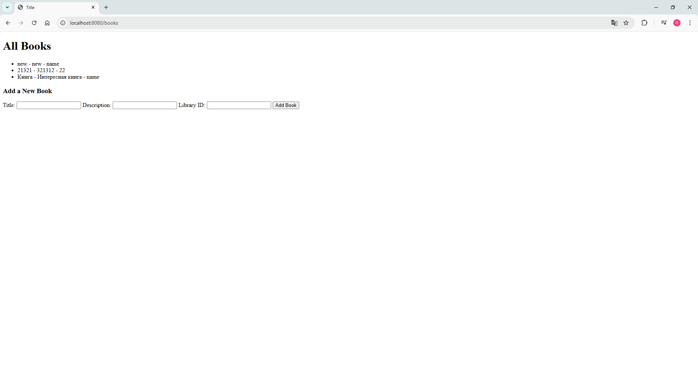

# Практическая работа №2. Приложение с использованием Spring Framework #

### The work was completed by students of the group 6132:
### ***Гресько Павел*** and ***Музырев Иван***

# Practical Work #2 #
## Application using Spring Framework
### General task
You are to develop an application using common JavaEE architecture and technologies. It should have three layers (data, logic, view) and provide means to work with a database.   
It is strongly recommended to use version control and source code management system (like GitHub).  
It is strongly recommended to use Maven to manage your project.   
You can choose any IDE, but IntelliJ IDEA is recommended.   
You may not use IDE to deploy your project to an application server. All deployment should be made using administrative console.
### Task 1
Choose any subject area and make a model with at least two entities with a few properties.   
Create a script to make a database for your model.   
Yes, you can use the same models and scripts you used before.

### Task 2
Develop data layer as Java Beans for the model and make them prepared for use with Hibernate.  
Create additional Hibernate classes and configuration files, as required.

### Task 3
Implement business layer using Spring beans.

### Task 4
Implement view layer using Spring MVC.

### Task 5
Make everything work together…

## Results

### Welcome page

### Libraries

### Books
